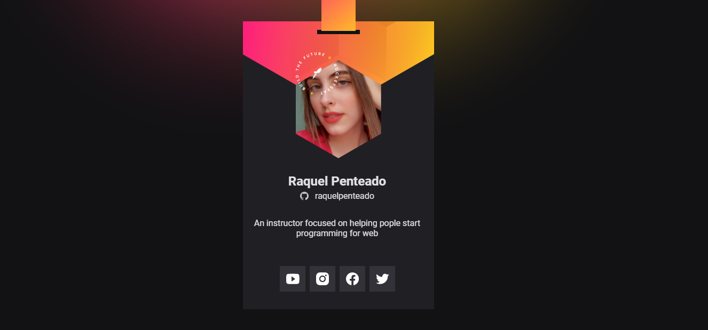
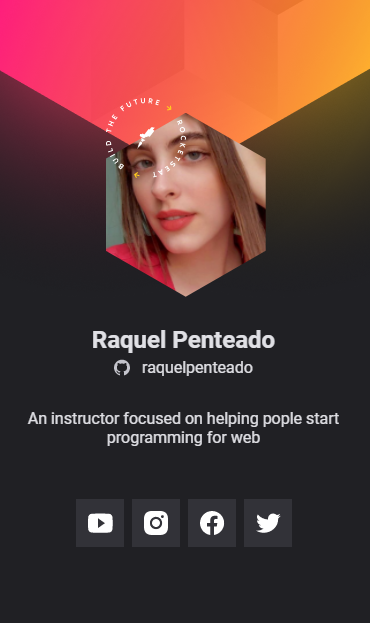

# NLW Heat - Mission: Origin

Está é uma solução trazendo uma responsividade da missão Origin.
## Table of contents

- [Overview](#overview)
  - [Screenshots](#screenshots)
- [My process](#my-process)
  - [Built with](#built-with)
- [Author](#author)

## Overview

 NLW Heat foi um evento produzido pela rocketseat com intuito de ensinar as pessoas. São 8 dias com aulas práticas e teóricas que ensinam muitas dicas sobre o Desenvolvimento Web.

### Screenshots

- Solution URL: [https://github.com/RaquelPenteado/nlw-heat](https://github.com/RaquelPenteado/nlw-heat)
- Live Site URL: [https://nlw-heat-ruby.vercel.app](https://nlw-heat-ruby.vercel.app)

## My process

### Built with

- Semantic HTML5 markup
- CSS custom properties
- Mobile-first workflow

## Author

- Rocketseat - [https://app.rocketseat.com.br/me/raquel-penteado-02954](https://app.rocketseat.com.br/me/raquel-penteado-02954)

- Twitter - [https://www.twitter.com/raquelpenteado](https://www.twitter.com/raquelpenteado)
